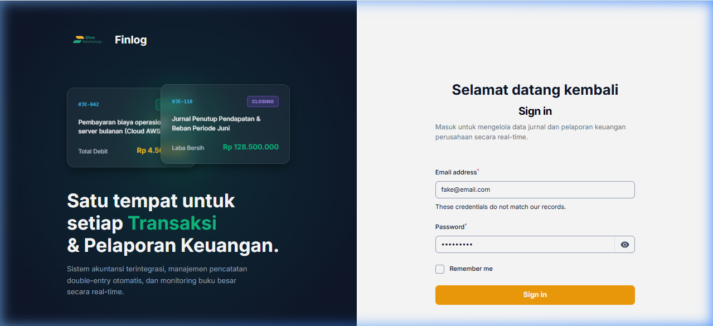
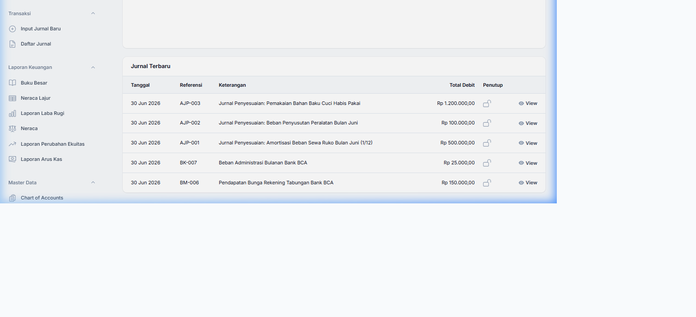
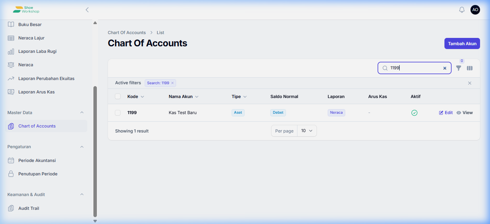
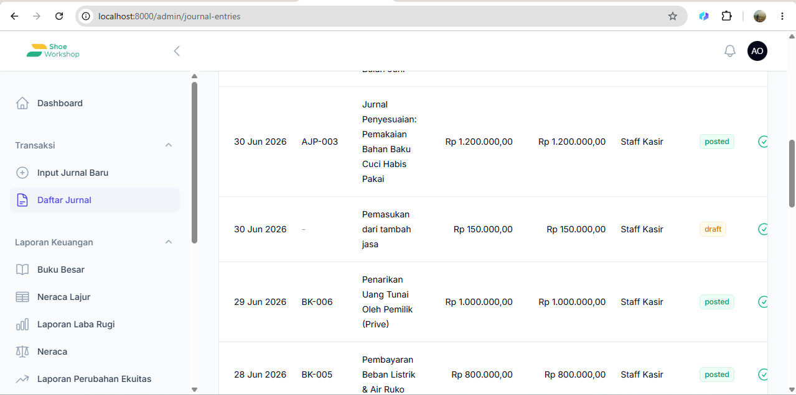
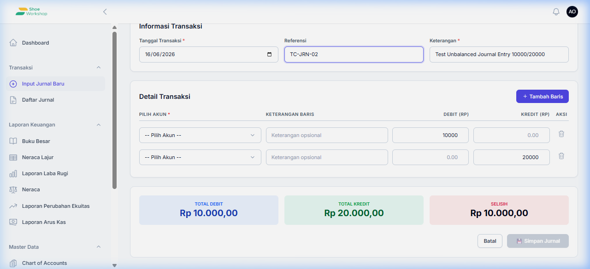
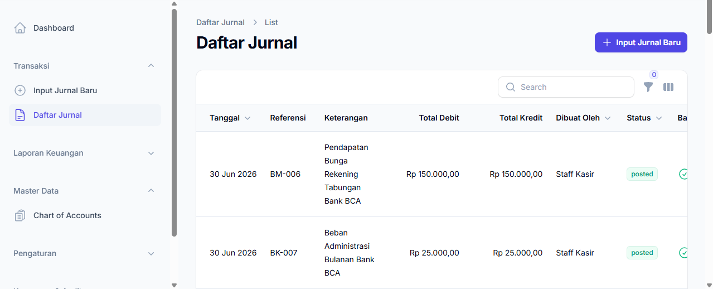
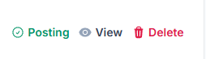
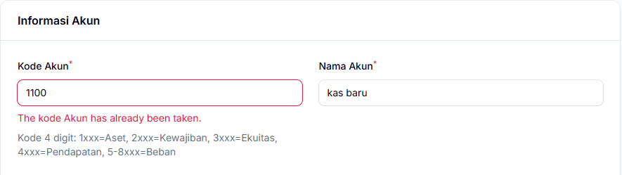

# Hasil Pengujian UI (UI Test Results) - Finlog

Laporan ini memuat tangkapan layar otomatis (*screenshot*) dari hasil pengujian UI pada Browser berdasarkan dokumen [UI Test Plan](../ui_test_plan.md) untuk Bagian 1 hingga 4.

## 1. Modul Autentikasi

**Kasus: Login Gagal dengan Kredensial Salah (TC-AUTH-03)**
Tampilan pesan *error* saat pengguna memasukkan kredensial yang salah.

*notes: pesan *error* buat menjadi bahasa indonesia (kata sandi atau password salah), buat jadi warna merah dan buat posisi nya ada di bawah button sign in

## 2. Dashboard (Beranda)

**Kasus: Memuat Widget Dashboard dengan Akun Owner (TC-DASH-01 s/d 04)**
Tampilan *dashboard* untuk akses tingkat Owner yang memuat semua *widget* informasi dan menu Laporan.

## 3. Manajemen Data Induk (Master Data)

**Kasus: Membuat dan Memverifikasi Chart of Accounts (TC-MST-01)**
Mencari akun baru (misal: "Kas Test Baru") di dalam tabel *Chart of Accounts*.

## 4. Penjurnalan (Journal Entries)

**Kasus: Simpan Jurnal Seimbang / Balanced (TC-JRN-01)**
Menunjukkan baris transaksi dengan Total Debit & Kredit yang sama, sehingga indikator "Balance" tercentang hijau.

*notes: dibagian jurnal ini sorting default nya buat dari yang terbaru dibuat. Akun COA nya ini enggak ada harusnya ada.

**Kasus: Validasi Jurnal Tidak Seimbang / Unbalanced (TC-JRN-02)**
Tombol **"Simpan Jurnal"** dinonaktifkan karena nilai Debit dan Kredit berselisih (tidak balance).

## 5. UI

input jurnal baru enggak usah ada di sidebar, karena udah ada di daftar jurnal

ini buat jadi ada background (buat jadi button) karena ini kaya text biasa

error message nya ubah konsistensikan jadi bahasa indonesia
