1. UI

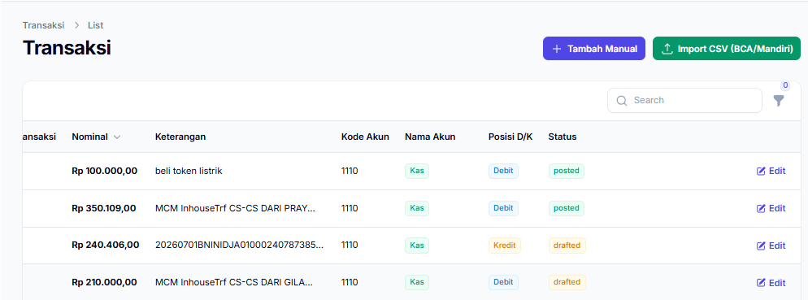
hapus edit untuk transaksi dari mutasi

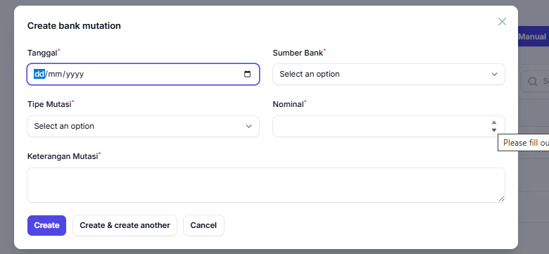

sumber bank ubah jadi "sumber dana" dan jadi input biasa bukan dropdown

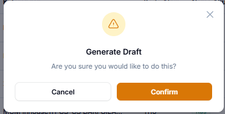

buat jadi bahasa indonesia serta konsisten kan untuk setiap modal untuk konfirmasi warna nya jadi warna orage kaya gini, modal delete merah

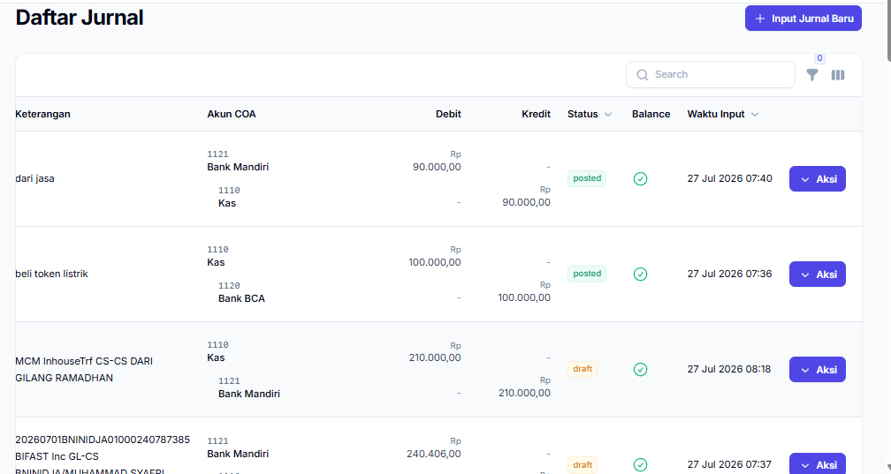

di daftar jurnal sudah tidak ada button untuk input jurnal baru, sudah tidak ada jurnal yang status nya masih draft, button aksi juga sudah tidak ada karena daftar jurnal adalah jurnal final

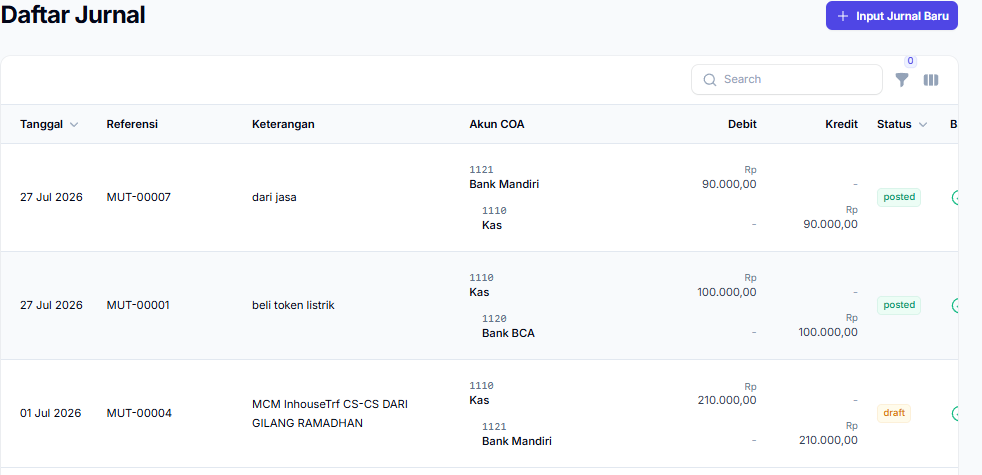

buat jadi di yang jajaran search, ini ada filter tanggal, bulan sama tahun, per 1 tabel itu 1 tanggal, tidak bisa melihat 2 bulan sekaligus, dia bisa ngeliat semua jurnal pada 1 bulan aja

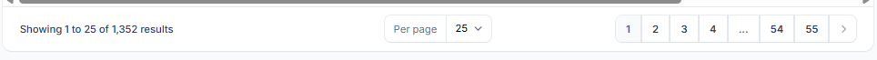
bagian pagination ini ubah jadi infinite scroll

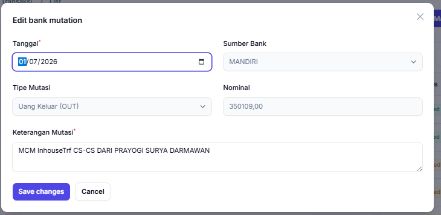

jika ini mutasi dari rekening bank hapus button save changes dan semua input disable, jika ini adalah transaksi input manual save changes, serta inputan nya tetap bisa di isi.

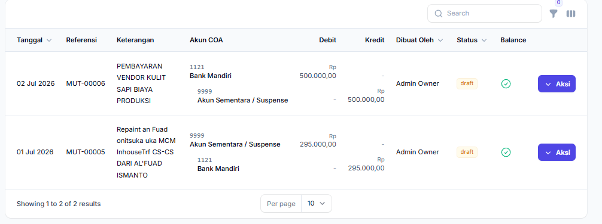

akun sementara nya ubah warna jangan item

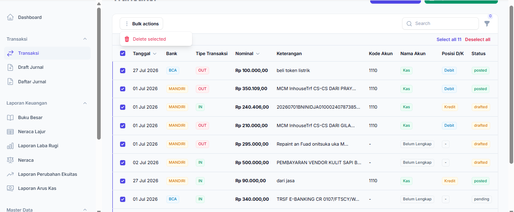

di transaksi di bulk action buat action generate draft, jadi semua yang di checklist bisa langsung di upload ke draft jurnal, waktu seudah klik generate draft dari bulk actions juga masih modal konfirmasi

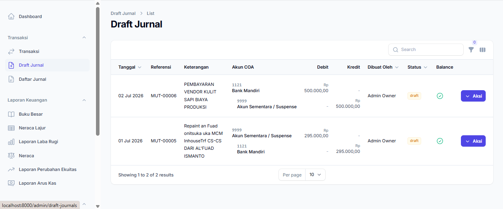

disini juga buat bisa checklist biar bisa 1 kali action bisa upload semua jurnal yang sudah siap di upload ke daftar jurnal

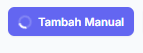

hampir setiap action button yang hanya untuk mengeluarkan modal ada loading yang seharusnya enggak ada loading, loading itu hanya saat bagian hit API

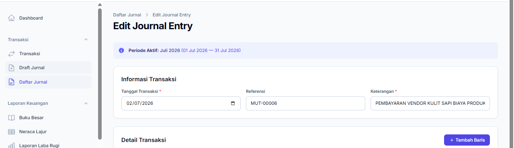

Breadcrumb nya sesuaikan lagi harusnya breadcrumb ini itu draft jurnal > list > edit
